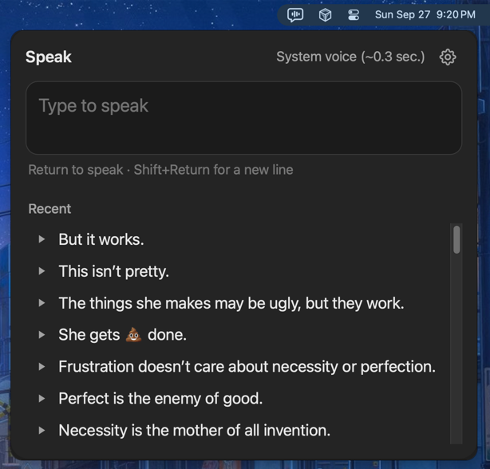

# LivingSpeech

LivingSpeech is an alternative for Apple's Live Speech app on macOS. It's a simple communication tool for people who can't speak. A simple menu-bar app that speaks what you type.



Compared to the Live Speech app macOS ships with in 2026 it has a number of advantages:

| Feature                           | LivingSpeech                                | 🍎's Live Speech                         |
|-----------------------------------|---------------------------------------------|------------------------------------------|
| Recent items                      | ✅                                          | ❌ Broken. Only shows items from iOS     |
| One click replay                  | ✅                                          | ❌                                       |
| UI Supports long texts.           | ✅                                          | ❌ Broken in multiple ways.              |
| Add recent text to input          | ✅                                          | ✅                                       |
| Custom voices                     | ✅ (via OpenVox)                            | ❌                                       |
| Resizeable text                   | ✅                                          | ❌                                       |
| Spell checking                    | ✅                                          | ❌                                       |
| Usable in Zoom, Google Meet, etc. | ✅ (via tools like Black Hole and Loopback) | ❌ FaceTime only, but you won't hear it. |

**LivingSpeech only runs on macOS v13 ( Ventura ) or later.**
It's built on macOS speech and window APIs and there are no plans for other platforms. Feel free to fork it.

## Features

- **Always a click away.** Lives in the menu bar with no Dock icon. Click
  the icon to show or hide the panel; Esc also hides it.
- **Two speech engines.**
  - **System voice** (the default) uses the voice you've chosen in System
    Settings › Accessibility › Spoken Content, including Siri voices.
    Speech starts almost instantly.
  - **[OpenVox](#openvox)** uses locally run AI voice models, with many
    voices to pick from and custom voices you can create yourself.
- **Type naturally.** Return speaks the text and clears the box;
  Shift+Return adds a new line. The text box grows as you type, up to
  half the screen height, then scrolls.
- **Recent phrases.** Everything you've said in the last 24 hours is kept
  for quick reuse.
- **Spell checking.** Misspelled words get the usual red underline, and
  right-clicking one offers suggestions.
- **Stop any time.** A stop button appears while speech is playing.
- **See what's taking so long.** A thin progress line shows how far a
  request is toward its timeout. It changes color once OpenVox has
  accepted the request and is generating audio.
- **Response times.** Next to the engine or model name, the panel shows
  its average time to start speaking, based on your last 100 requests.
- **Adjustable size.** Set the font size in Settings and the whole panel
  scales with it.
- **Stays where you put it.** Drag the panel by its top bar; it reopens in
  the same place, even after quitting.

## Installation

## Allowing an Unsigned app

LivingSpeech isn't a signed app, so regardless of which installation method you choose, macOS will refuse to open it the first time. To allow it:

1.  Open LivingSpeech. macOS will warn that it can't verify the app.
    Close the warning.
2.  Open **System Settings › Privacy & Security**.
3.  Scroll to the bottom of the pane. In the Security section you'll see
    a note about LivingSpeech being blocked. Click **Open Anyway**.
4.  Confirm when asked. After this, LivingSpeech opens normally.

## With Homebrew

Run the following commands in your terminal to load my tap, and install LivingSpeech.
Note: you will still

    brew tap masukomi/homebrew-apps
    brew install living_speech

## Manually

Download the `*.app.zip` file latest release on the [releases page](https://github.com/masukomi/living_speech/releases), double-click to uncompress it, and drag the LivingSpeech app to your Applications folder.

## Usage

Click the menu bar icon, type what you want said, and press Return. Shift+Return inserts a newline without speaking.

Recent entries are shown below the text input:

- Click the **play button** to the left of an entry to speak it again immediately.
- Click the **text** of an entry to put it in the text box so you can edit it before speaking.

Click the gear icon to open Settings, where you choose the speech engine and font size. Right-click the menu bar icon to quit.

### Correcting Bad Pronunciation

Sometimes text to speech systems don't know how to pronounce a word correctly. For example, the acronym "CLI" is frequently pronounced "klee" which is confusing. This is especially problematic with proper nouns.

You'll find an area for custom "Pronunciations" on the settings screen. One per line: a word, and how to pronounce it, separated by -&gt; or →

For example:

``` text
cli -> see el eye
```

LivingSpeech will replace your custom words with their phonetic spellings before shipping them off to the speech engine.

### System voice

LivingSpeech speaks with the System Voice from **System Settings ›
Accessibility › Spoken Content**. Settings has a button that takes you
there. Siri voices sound the most natural. Changes to the System Voice
take effect the next time you speak.

### OpenVox

On a maxed-out M1 Mac, the models currently available in OpenVox can
take six to ten seconds before you hear your text spoken. This isn't practical
for everyday communication needs.

I've left support for OpenVox in in hopes that newer Macs will
have more acceptable response times.

What OpenVox offers is voice selection: many voices across its models,
plus custom voices you can create by cloning a voice or describing one
in a prompt. OpenVox is a \$20 app on the Mac App Store. See the
[OpenVox home page](https://theoracleguy.in/openvox) for details.

To use it:

1.  Install OpenVox and turn on its Local API.
2.  In LivingSpeech's Settings, set **Engine** to OpenVox.
3.  Pick a model, language, and voice. The lists come straight from
    OpenVox each time you open Settings.

LivingSpeech connects to OpenVox at `http://127.0.0.1:8000/v1`. If it
can't reach OpenVox, a banner says so.

## Your data

Settings, recent phrases, response times, and the panel's position are
stored in `~/Library/Application Support/LivingSpeech/`. Nothing is sent
anywhere except to OpenVox on your own Mac when it's the selected
engine.

## Development

LivingSpeech is written in Go and TypeScript using [Wails v3](https://v3.wails.io).
It was created with Claude Code. Yes, that sucks. But so does
trying to communicate with the half-assed accessibility
tools Apple keeps putting out.

``` bash
wails3 dev          # live-reload dev build
wails3 build        # production binary in bin/
go test ./...       # unit tests
OPENVOX_LIVE=1 go test -run Live -v ./internal/openvox   # against a running OpenVox
```
